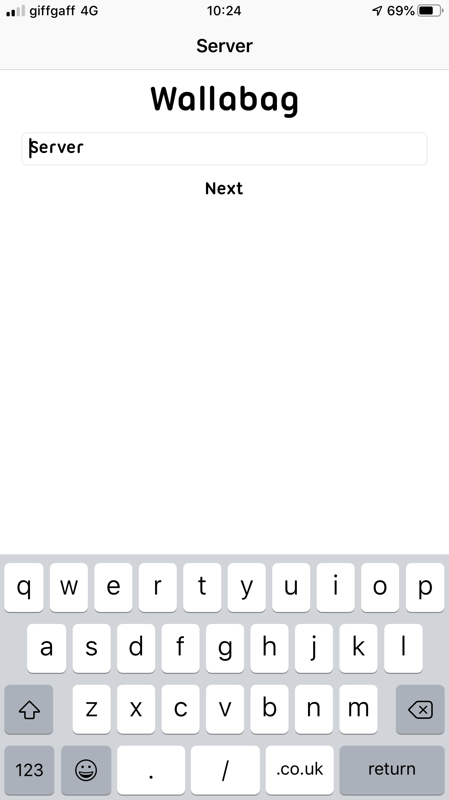
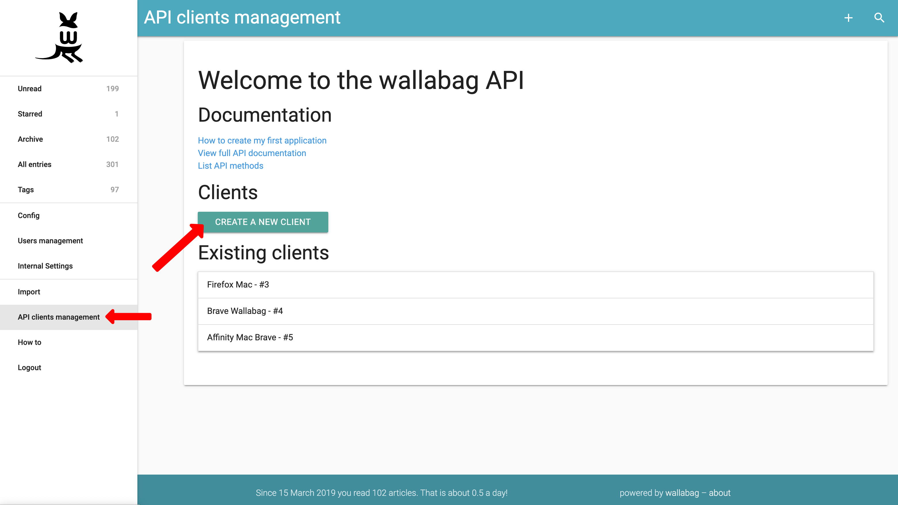
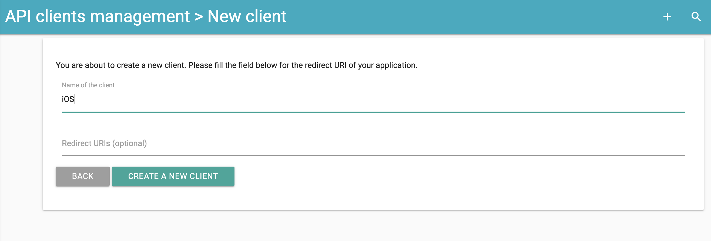
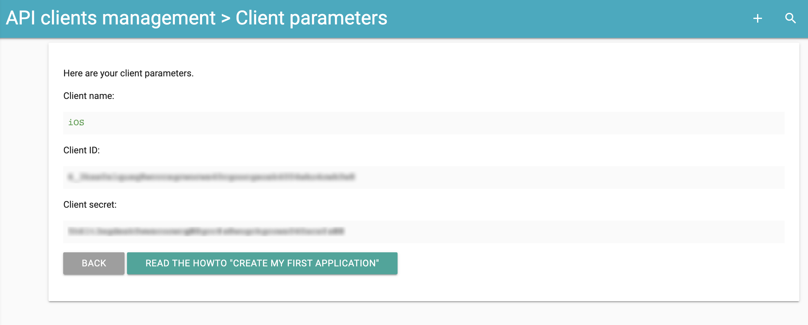
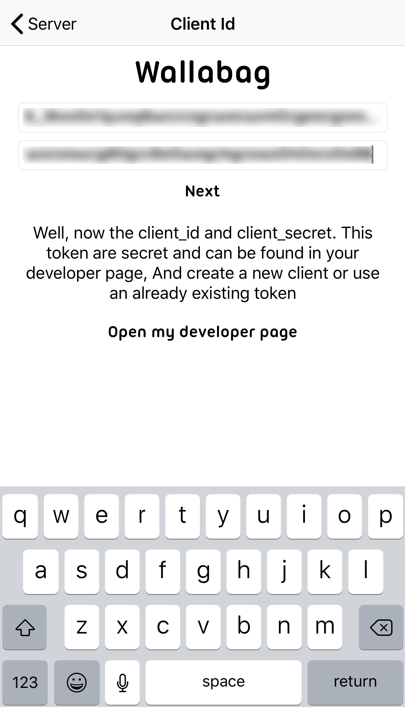
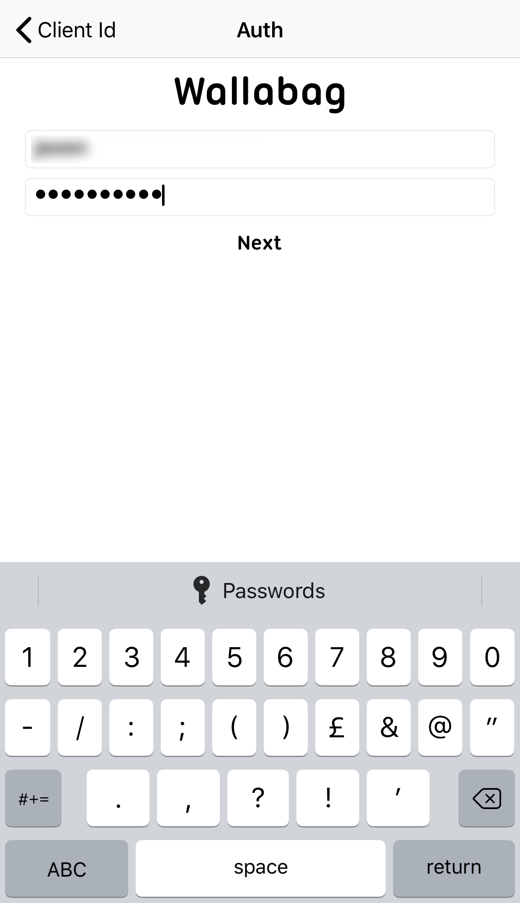
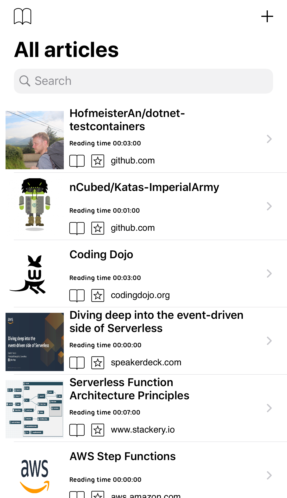

# iOS application

## Purpose of this document

This document describes how you can setup your iOS application to
work with your Wallabag V2 instance.

## Steps to configure your app

When you first start the app, you will see the welcome screen with a 'Register' button. This button will take you through configuring your app.

The first page prompts for your Wallabag address. Enter the url in the text box. **It is important that this URL does not end with a slash**.

Your URL will look something like this:
* https://wallabag.example.com
* https://www.example.com/wallabag
* https://framabag.org/u/your-username

After pushing 'Next' you should be prompted for a Client Id and Secret. To generate these details login to Wallabag in a browser, and navigate to 'API Clients Management'.

Click 'Create a New Client'. You'll need to give the client a name. Something like 'iOS' or 'My iPhone' would be appropriate.

Click 'Create a New Client'. At this point you should see a Client ID and Client secret.

You'll need to enter these into the Wallabag iOS app. It may be beneficial to copy them somewhere you can access on your iOS device if using a desktop browser. **Make sure they remain private**

After clicking 'Next' you'll be prompted for your username and password. These are the same credentials used to login to the Wallabag web application.

Once you've entered your credentials, Click 'Next'. You should then be taken to the main Wallabag app screen. It may be empty to being with, drag the list down to force a refresh. After a few seconds your articles will begin to appear. (This may take a short while depending on the speed of your connection and how many articles you have in Wallabag)

## References

- [Source code of the iOS application](https://github.com/wallabag/ios-app)
- [iOS Application on the Apple AppStore](https://apps.apple.com/us/app/wallabag-2-official/id1170800946)
