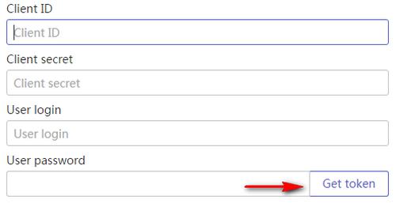
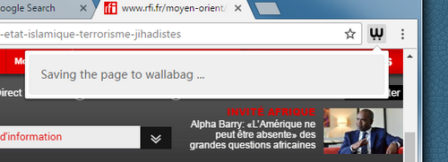
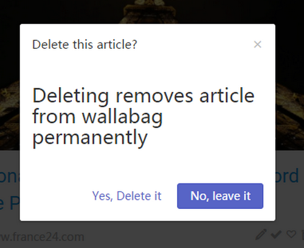

# Save articles

The main purpose of wallabag is to save web articles. You have many ways
to do it. If you think that the article is wrong displayed,
[you can read this documentation](../errors_during_fetching.md).

## By using a bookmarklet

On the `Howto` page, you have a `Bookmarklet` tab. Drag and drop the
`bag it!` link to your bookmarks bar of your browser.

Now, each time you're reading an article on the web and you want to save
it, click on the `bag it!` link in your bookmarks bar. The article is
saved.

## By using the classic form

In the top bar of your screen, you have 3 icons. With the first one, a
plus sign, you can easily save a new article.

Click on it to display a new field, paste the article URL inside and
press your `Return` key. The article is saved.

## By using a browser add-on

### Firefox

You can download the [Firefox addon
here](https://addons.mozilla.org/firefox/addon/wallabagger/).

### Chrome

You can download the [Chrome addon
here](https://chrome.google.com/webstore/detail/wallabagger/gbmgphmejlcoihgedabhgjdkcahacjlj?hl=fr).

### Opera

You can download the [Opera addon
here](https://addons.opera.com/en/extensions/details/wallabagger/).

### Edge

You can download the [Edge addon
here](https://www.microsoft.com/en-us/store/p/wallabagger/9p41cnlppmfz).

### How to use our addon

wallabagger is a browser extension to add pages to wallabag, with the ability to:

- save current page
- edit title
- add (with autocomplete!) and remove tags
- set starred and archived
- delete

#### Options

First of all you have to create a new client on your wallabag installation. How to do that is described in [Documentation](https://doc.wallabag.org/en/developer/api/oauth.html#creating-a-new-api-client)

What we need from that client is two strings: Client ID and Client secret.

   

##### Access options page

After the installation of Wallabagger extension you can setup it by going to the options page. This page is accessible by

- Right click on extension icon and choose menu "options"

   

- Go to your Chromium-based browser [extension setup page](chrome://extensions), and click on the "options" link in the Wallabagger section

   

##### Setup process

- Enter the URL of your wallabag installation (without "http://" ), check "https" if you use that, and click "Check URL" button

   

   if the URL is valid then in checklist in the bottom of page will be information about that.

   

- If the URL was checked and a correct api is found, then the client and user credential fields appears. Fill them and click the "Get token" button. From now access token will be fetched authomatically, when it expires.

   

    if the credentials are correct you'll see it in the checklist with an information about that.

   

- If you have tags including spaces, check appropriate options. This will toggle the ending tag key from Space to Enter

   

##### Security warning

In this version of the extension your password is stored in the browser local storage as a plain text and could be retrieved by anyone with access to your computer. The password encryption will be implemented in future versions.

#### Usage

##### Saving article

After installation and successful setup you can add articles to wallabag by clicking on the Wallabagger extension icon

   

wait a couple of seconds

   

(There also may be message "Obtaining wallabag api token" if the application token is expired (once in two weeks))
If something goes wrong, an error message appears:

   

In that case, check your options.

If there was no errors, main window with saved article appears. Note: if the article from this URL was already saved, this article will appear with its tags, title, and flags (starred, archived).

##### Article window

The article window consists from:

- the article picture
- the title - clicking it opens article in the wallabag interface

- domain name - clicking it opens source article

- icons:
  - edit title icon  clicking it opens dialog to edit the title

   

  - set archived and starred flags icons  These icons change its appeareance when the flags are set 
  - delete article icon  clicking it opens a confirmation dialog  to make sure you want to delete your article

   

- tags area: article tags with input field for adding new tags

   

##### Working with tags

Tags applied to the article appear in the tags area before the input field. You can remove a tag from an article by clicking on the cross symbol next to the tag.

   

When you type the name of a new tag in the input field, after three letters, Wallabagger begins to search in existing tags. Found tags appear on the bottom of the input field. You can add them by clicking on them or by pressing the right arrow key.

   

You can add typed in input field tag by pressing ",", ";" or the Space key (if you didn't checked the option "Use space in tags" inside the extension settings) or the Enter key (if you checked the option)

## By using your smartphone application

### Android

You can download the [Android application
here](https://play.google.com/store/apps/details?id=fr.gaulupeau.apps.InThePoche)
or on
[F-Droid](https://f-droid.org/repository/browse/?fdid=fr.gaulupeau.apps.InThePoche).

### Windows Phone

You can downlaod the [Windows Phone application
here](https://www.microsoft.com/store/apps/9nblggh5x3p6).
